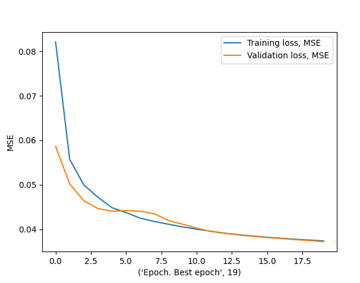

# Denoising

## Общая информация и идея
Учитывая специфику исходных данных, в качестве основы модели была выбрана рекуррентная модель (хороши для time series данных и сигналов). Наиболее подходящей показалась модель на основе GRU, так как в среднем она показывает примерно схожие результаты с LSTM, если не лучше, а также в среднем обычно чуть быстрее. Теоретически результаты могут быть чуть лучше если сделать модель более комплексной, по крайней мере существуют различные вариации, которые показали неплохие результаты, например DNN + GRU.

В целом наибольшая проблема была с предварительной обработкой данных, чтобы можно было закидывать большими батчами на обучение и инференс. В исходном виде батчи нельзя засылать по причине разного размера у исходных данных (длительность у записей, очевидно, различается), поэтому было решено делать паддинг для исходных данных увеличивая длительность записи до максимально значения среди данных в текущем батче.

Данные грузятся с помощью DataLoader’а, который берет объект класса  ```MyDataset```, который фактически является переопределенным базовы классом PyTorch ```torch.utils.data.Dataset``` ; 

Все основные функции для манипуляций с данными и сама модель GRU в ```utils.py```.


Все нижеуказанные команды для запуска внутри папки denoising, в котором лежат ```training.py``` и ```Inference.py```. 
Тренировочные данные по умолчанию располагаются по пути ‘./train/train/‘, в соответствии с тем, как была представлена исходная структура в архиве. 
Команды с аргументами (обычный argparse).
Результаты инференса - ```.npy``` файлы экспортированные в аналогичном формате (записи в папках для отдельных спикеров).


\
*MSE метрика для тренировочных и валидационных данных в течение 20 эпох обучения.*

## Команды для запуска
Необходимо распаковать данные для обучения и валидации в папку ```./denoising```\
Находясь в папке ```./denoising``` необходимо установить необходимые библиотеки и дальше использовать команды ниже для обучения и инференса.
### Установка необходимых пакетов
```
pip3 install -r .\requirements.txt
```
### Training

```
python .\training.py -batch_size 256 -number_of_epoch 20 -train_path ./train/train/ -val_path ./val/val/ --plot_losses
```
### Inference

```
 python .\Inference.py -batch_size 512 -inference_path .\val\val\ -model_path .\best.pt -output_path .\output\
```
